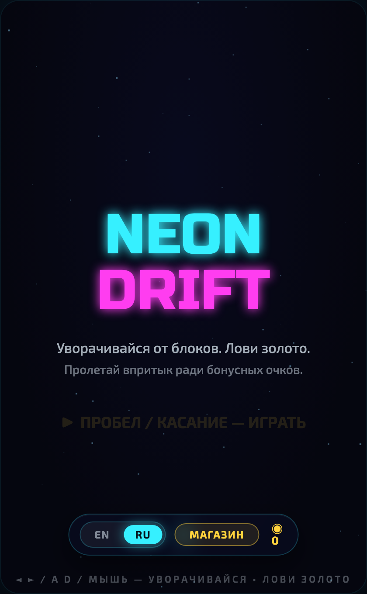
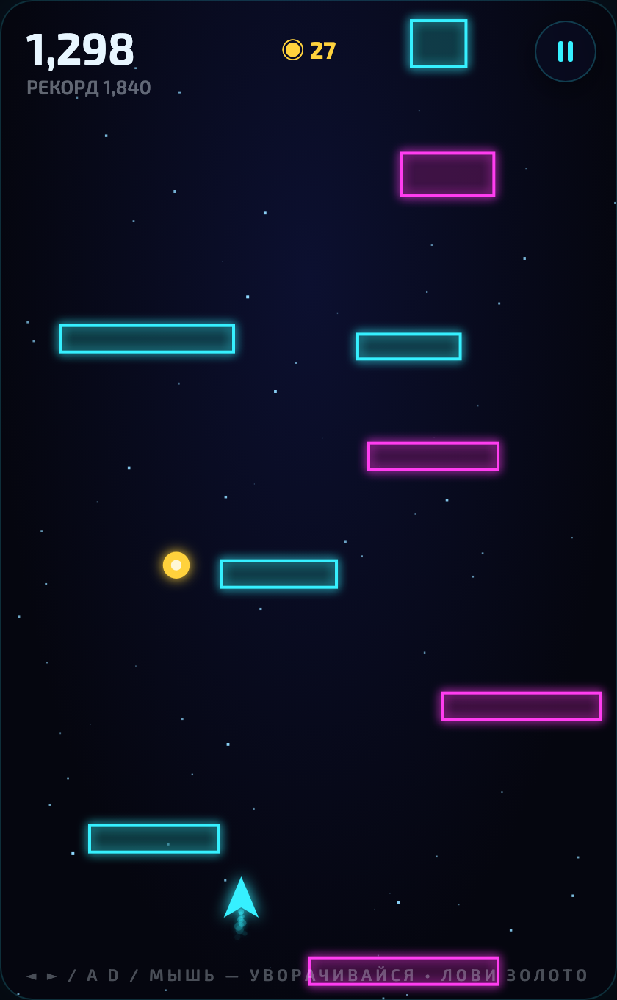
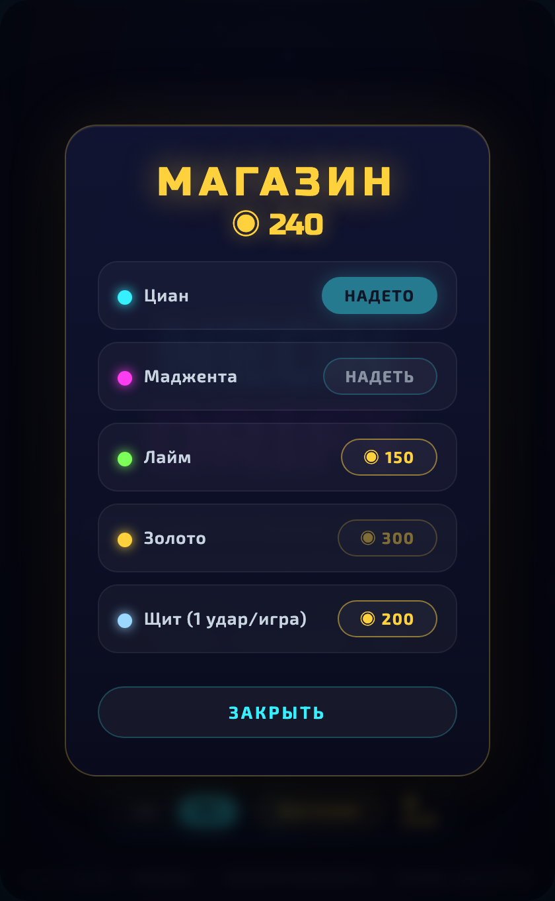
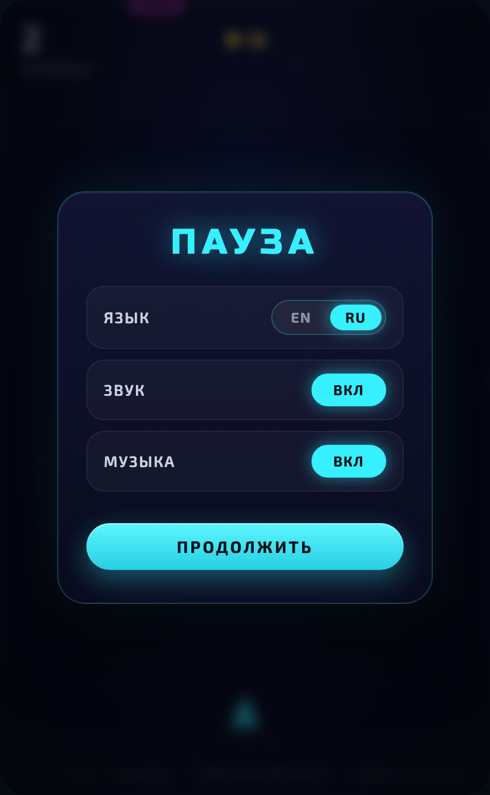

# Neon Drift («Неон Дрифт»)

Двухмерная аркадная игра в стиле synthwave: управляйте неоновым кораблём, уворачивайтесь от падающих блоков, собирайте золотые монеты и продержитесь как можно дольше. С каждой секундой темп ускоряется, а музыка становится насыщеннее.

Проект подготовлен для защиты в **Ставропольском государственном аграрном университете (СтГАУ)**.

**Играть онлайн:** https://flower66600.github.io/neon-drift/

## Авторы

Студенты группы **25ИСИП-С-9-3**:

- Слободяник Владимир
- Узденов Ислам
- Арустамян Даниэль

## Скриншоты

| Главное меню | Игровой процесс |
| :---: | :---: |
|  |  |
| **Магазин** | **Пауза** |
|  |  |

## Как играть

- Уворачивайтесь от падающих блоков — одно столкновение завершает забег.
- Пролетайте впритык мимо блоков, чтобы получить бонусные очки.
- Собирайте золотые монеты — это игровая валюта.
- Тратьте монеты в магазине на скины корабля и улучшение «Щит» (поглощает один удар за забег).
- Чем дольше живёте, тем быстрее игра и интенсивнее музыка.

## Управление

- **Компьютер:** стрелки ◄ ►, клавиши `A` / `D` (а также `Ф` / `В` для русской раскладки) или мышь.
- **Телефон:** ведите пальцем по экрану — корабль смещается вслед за движением.
- **Пауза:** кнопка в правом верхнем углу или клавиша `P` / `Esc`.

## Возможности

- Неоновая графика на HTML5 Canvas: свечение, частицы, трасса корабля, тряска экрана.
- Нарастающая сложность и многослойная музыка, синтезируемая прямо в браузере (Web Audio API).
- Магазин: скины корабля и улучшения за собранные монеты.
- Меню паузы с переключателями звука, музыки и языка.
- Поддержка двух языков интерфейса: русский и английский.
- Сохранение рекорда, монет и покупок между сессиями (localStorage).
- Адаптация подсказок управления под устройство (ПК или телефон).

## Технологии

- HTML5 Canvas
- Чистый JavaScript (без библиотек и сборщиков)
- CSS3
- Web Audio API для звука и музыки

## Как создавалась игра

### Выбор технологий

Для проекта намеренно выбран стек без игровых движков и сторонних библиотек: HTML5 Canvas и чистый JavaScript. Это даёт полный контроль над отрисовкой, не требует установки и сборки, а готовая игра запускается в любом браузере как на компьютере, так и на телефоне.

### Архитектура

В основе игры — единый игровой цикл на `requestAnimationFrame`. Каждый кадр делится на два этапа: обновление состояния (`update`) и отрисовку (`draw`). Игра работает как конечный автомат с состояниями: меню, игра, пауза и экран проигрыша. Расчёт движения привязан ко времени между кадрами (delta time), поэтому скорость одинакова на устройствах с разной частотой обновления экрана.

### Игровая механика

Препятствия появляются сверху со случайными размерами и позициями, а частота и скорость их падения растут вместе со временем выживания — так нарастает сложность. Столкновения проверяются по принципу «окружность — прямоугольник»: корабль описан окружностью, блоки — прямоугольниками. За пролёт впритык мимо блока начисляются бонусные очки.

### Графика

Весь визуальный стиль рисуется на Canvas: неоновое свечение через тени, частицы для следа корабля и взрывов, тряска экрана и вспышки при событиях, параллакс-звёзды на фоне. Интерфейс (меню, магазин, пауза) сделан на HTML и CSS поверх холста, что позволило применить плавные скругления, стекло-эффект и аккуратную типографику.

### Звук и музыка

Звук полностью синтезируется в браузере через Web Audio API — без единого аудиофайла. Эффекты собираются из осцилляторов и фильтров, ударные — из отфильтрованного шума. Музыка построена как пошаговый секвенсор по аккордовой прогрессии: чем дольше длится забег, тем быстрее темп и тем больше музыкальных слоёв (бас, арпеджио, ударные, «искры»).

### Данные и локализация

Прогресс игрока (рекорд, монеты, купленные скины, настройки и язык) сохраняется в `localStorage` браузера и переживает перезагрузку. Интерфейс переведён на русский и английский, а подсказки управления подстраиваются под устройство — клавиатура и мышь на компьютере, свайп на телефоне.

### Этапы работы

1. Прототип: игровой цикл, управление и базовое уклонение от блоков.
2. Игровая механика: коллизии, очки, нарастающая сложность.
3. Оформление: неоновый стиль, частицы, эффекты, интерфейс.
4. Экономика: золотые монеты, магазин, скины и улучшение «Щит».
5. Звук: процедурные эффекты и динамическая музыка.
6. Адаптация под мобильные устройства и публикация на GitHub Pages.

## Запуск

Игра не требует установки и сервера. Достаточно открыть файл `index.html` в любом современном браузере.

Онлайн-версия доступна по адресу: https://flower66600.github.io/neon-drift/

## Структура проекта

- `index.html` — разметка и игровая логика
- `styles.css` — оформление интерфейса
- `README.md` — описание проекта
